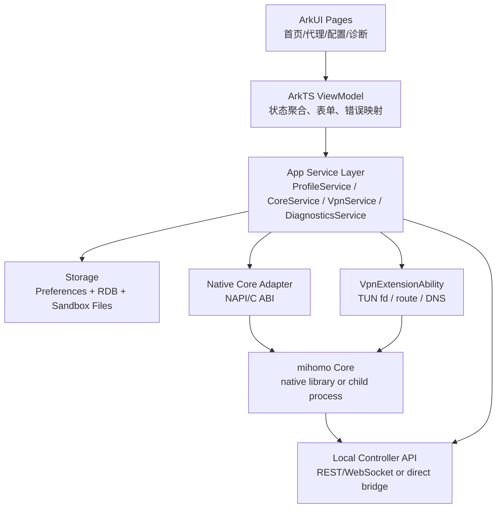
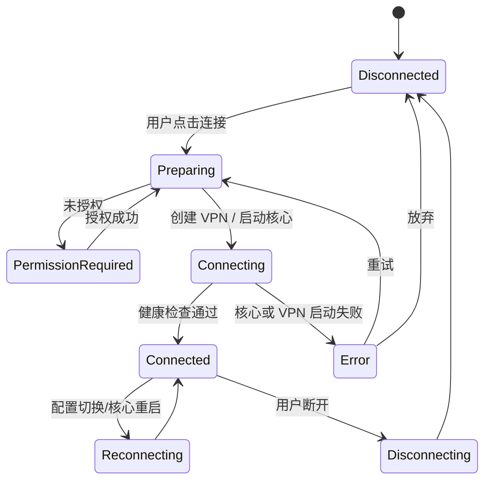

# Clash Harmony 鸿蒙版产品规划与设计文档

版本：0.1  
日期：2026-07-01  
依据：clash-verge-rev 上游仓库 `9a2f4ff`（2026-06-30）调研、HarmonyOS/OpenHarmony 公开文档调研

## 1. 背景与目标

Clash Verge Rev 是一个基于 React、Tauri 2、Rust 的桌面端 Clash Meta/mihomo GUI。它的核心价值不只是“开关代理”，还包括配置订阅管理、配置增强、代理组选择、连接/日志观测、TUN 模式、WebDAV 备份、媒体解锁检测等高级能力。

鸿蒙版不应简单复刻桌面 UI。移动端用户的主要任务是快速确认网络状态、切换代理、更新订阅、排障；系统层能力则从桌面端的“系统代理 + 托盘 + sidecar/service”转为“VPN Extension + 后台任务 + 通知可见状态 + 移动端权限引导”。

本项目的目标是开发一款面向 HarmonyOS NEXT/OpenHarmony 标准系统的 Clash/mihomo 客户端，代号暂定为 **Clash Harmony**。

### 1.1 产品目标

1. 提供稳定、低干扰的移动端代理/VPN 体验。
2. 兼容 Clash/mihomo 常见配置、远程订阅、代理组选择和规则模式。
3. 保留 Clash Verge Rev 的配置增强能力，但以移动端可理解、可恢复的方式呈现。
4. 提供足够的观测和诊断能力，帮助用户定位订阅、节点、DNS、规则、连接和权限问题。
5. 为后续平板、折叠屏、桌面模式、多设备协同预留信息架构。

### 1.2 非目标

1. MVP 不做桌面端托盘、全局快捷键、UWP 工具、Windows/macOS/Linux 特定功能。
2. MVP 不做完整 Web UI 管理器，保留外部控制器能力作为调试/高级功能。
3. MVP 不追求与 Clash Verge Rev 所有设置项一一对应，优先保证移动端核心链路稳定。
4. MVP 不承诺覆盖所有 Clash/mihomo 实验特性；能力以实际可运行核心和鸿蒙 VPN 能力为准。

## 2. 上游能力盘点

上游 Clash Verge Rev 的主要能力边界如下：

| 模块 | 上游实现 | 鸿蒙版策略 |
| --- | --- | --- |
| UI | React 19 + MUI + Vite，多页面管理台 | ArkTS/ArkUI 原生重做，复用信息架构，不复用桌面 UI |
| 后端 | Tauri 2 + Rust command 层 | 改为 ArkTS 服务层 + Native Core Adapter |
| 核心 | mihomo sidecar/service，Tauri 插件访问 API | 优先移植 mihomo 核心，封装为本地核心进程或 native library |
| 配置 | `profiles.yaml`、`verge.yaml`、runtime yaml | 迁移为鸿蒙 Preferences/RDB + app sandbox 文件 |
| 配置增强 | Merge、Script、Rules、Proxies、Groups、TUN 注入 | 保留 Merge/Rules/Proxies/Groups；Script 需安全沙箱策略 |
| 代理模式 | rule/global/direct | 保留 |
| 系统代理 | 桌面 OS 系统代理/PAC | 移动端替换为 VPN 开关，不做系统代理入口 |
| TUN | 桌面虚拟网卡模式 | 由 HarmonyOS VPN Extension 承担等价能力 |
| 连接/日志/流量 | mihomo API + WebSocket/轮询 | 保留，移动端做轻量列表与诊断视图 |
| 备份 | 本地备份 + WebDAV | V1 保留本地导入导出，V1.5 做 WebDAV |
| 媒体解锁检测 | 多服务检测命令 | V1.5 作为工具页/高级诊断 |

上游一级页面：首页、代理、配置、连接、规则、日志、解锁检测、设置。鸿蒙版建议收敛为 4 个主 Tab：`首页`、`代理`、`配置`、`诊断`，设置作为右上角或“我的/更多”入口。

## 3. 用户与场景

### 3.1 目标用户

1. 已有 Clash/mihomo 配置的进阶用户，希望在鸿蒙设备上延续原有订阅。
2. 需要在移动网络、Wi-Fi、热点、办公网络间切换的用户。
3. 需要观察连接、规则命中、DNS 和节点延迟的排障用户。
4. 需要在手机、平板、折叠屏间获得一致体验的鸿蒙生态用户。

### 3.2 核心用户旅程

1. 首次启动：导入订阅或本地 YAML -> 授权 VPN -> 一键连接 -> 验证当前节点和流量。
2. 日常使用：打开 App -> 查看连接状态 -> 切换代理组/模式 -> 退出后台继续运行。
3. 订阅维护：更新订阅 -> 配置增强 -> 失败回滚 -> 继续使用上一个可用运行配置。
4. 排障：打开诊断 -> 查看日志/连接/规则命中/DNS -> 导出诊断包。
5. 迁移：从桌面端或旧设备导出备份 -> 导入鸿蒙版 -> 校验配置与代理组。

## 4. 产品信息架构

### 4.1 主导航

| Tab | 目标 | 主要内容 |
| --- | --- | --- |
| 首页 | 快速判断和控制当前状态 | VPN 开关、当前配置、当前代理、上传/下载速率、模式、最近错误 |
| 代理 | 切换节点和策略组 | 策略组列表、节点延迟、筛选排序、批量测速、链式代理入口 |
| 配置 | 管理订阅和配置增强 | 订阅列表、本地配置、更新、启用/排序、Merge/Rules/Proxies/Groups 编辑 |
| 诊断 | 观测和排障 | 连接、日志、规则、DNS、运行配置、导出诊断 |

设置入口包括：通用、网络、DNS、VPN、核心、备份、安全、关于。

### 4.2 首页设计

首页应是一个“可一眼读懂”的运行面板，不是桌面端卡片集合的缩小版。

关键区域：

1. 顶部状态：连接中/已断开/启动失败/配置错误。
2. 主开关：连接/断开 VPN，启动失败时直接显示可操作的错误原因。
3. 当前配置：配置名、更新时间、订阅流量信息。
4. 当前代理：主策略组当前节点，支持快速切换。
5. 模式切换：规则、全局、直连。
6. 流量概览：实时上下行、累计流量、连接数。
7. 最近问题：DNS 失败、核心崩溃、订阅更新失败、VPN 权限被撤销。

### 4.3 代理页设计

代理页服务于“快速选节点”和“确认节点质量”。

能力：

1. 策略组分段展示：优先展示当前路径上的关键策略组。
2. 节点行展示：名称、地区/图标、延迟、类型、提供者、UDP 标识。
3. 筛选排序：按延迟、名称、提供者、类型、可用性。
4. 批量测速：当前组测速、全部可见节点测速。
5. 自动选择：保留 URL-Test/Fallback 等 mihomo 策略组语义，不在 UI 中重新发明。
6. 链式代理：作为高级模式，默认收起，开启时明确提示风险和当前链路。

### 4.4 配置页设计

配置页承担“导入、更新、启用、增强、恢复”。

能力：

1. 导入订阅 URL、剪贴板、二维码、本地 YAML 文件。
2. 远程订阅更新、失败重试、更新日志。
3. 本地配置编辑：移动端默认只做安全编辑，完整 YAML 编辑放入高级模式。
4. 配置增强：Merge、Rules、Proxies、Groups 分开管理，支持全局增强和单配置增强。
5. 运行配置预览：展示最终生成的 runtime YAML，并支持回滚到上一次可用配置。
6. 配置校验：导入、保存、启用前统一做语法校验、核心 dry-run 或等价验证。

### 4.5 诊断页设计

诊断页聚合桌面端的连接、规则、日志、解锁检测能力。

能力：

1. 连接：活跃连接、已关闭连接、按域名/IP/进程或应用搜索，支持关闭单个/全部连接。
2. 日志：等级筛选、搜索、暂停、清空、导出。
3. 规则：规则列表、规则提供者、命中测试。
4. DNS：当前 DNS 配置、最近解析失败、DNS 泄漏提示。
5. 运行状态：核心版本、运行时长、内存、连接数、端口、VPN fd 状态。
6. 诊断导出：配置摘要、runtime 校验结果、核心日志、App 日志、系统能力状态。

## 5. 功能分期

### 5.1 MVP / 0.1 技术验证版

目标：证明鸿蒙设备上可以稳定跑通“导入配置 -> 启动核心 -> 建立 VPN -> 切换代理 -> 观测日志”闭环。

功能：

1. ArkTS/ArkUI 原生基础框架。
2. VPN 权限申请、启动、停止、状态同步。
3. mihomo 核心启动方式验证：native library 或 native child process 二选一。
4. 本地 YAML 导入、远程订阅导入。
5. rule/global/direct 模式切换。
6. 代理组读取、节点选择、延迟测试。
7. 基础日志、实时上下行速率、错误提示。
8. 最小配置校验与失败回滚。

验收：

1. 冷启动 5 秒内进入可操作状态。
2. 已有可用配置下，一键连接成功率达到日常可用标准。
3. 核心崩溃后能停止 VPN 并显示错误，不留下错误路由状态。
4. 配置更新失败时保留上一份可用 runtime 配置。

### 5.2 1.0 公测版

目标：达到日常使用水平。

功能：

1. 完整订阅管理和配置增强。
2. 连接列表、日志筛选、规则查看。
3. DNS 设置与常见泄漏提示。
4. 通知栏运行状态。
5. 本地备份、导入导出。
6. 折叠屏/平板适配。
7. 深浅色、基础多语言。
8. 崩溃恢复、诊断包导出。

### 5.3 1.5 增强版

目标：追平 Clash Verge Rev 的高级特性中适合移动端的部分。

功能：

1. WebDAV 备份与同步。
2. 媒体解锁检测。
3. 链式代理 UI 完整化。
4. 配置二维码导入/分享。
5. 更细粒度规则命中测试。
6. 外部控制器高级开关。

### 5.4 2.0 生态版

目标：面向鸿蒙多设备体验。

功能：

1. 手机/平板/桌面模式统一布局。
2. 多设备配置同步策略。
3. 状态卡片/服务卡片能力评估。
4. 企业/团队配置分发模式评估。

## 6. 技术架构设计

### 6.1 推荐架构



### 6.2 模块职责

| 模块 | 职责 |
| --- | --- |
| `entry` UIAbility | App 启动、导航、权限引导、设置入口 |
| `VpnExtensionAbility` | VPN 生命周期、TUN fd 创建/销毁、后台可见运行状态 |
| `CoreService` | 核心启动、停止、重启、健康检查、崩溃恢复 |
| `ProfileService` | 订阅、本地配置、配置启用、配置更新 |
| `EnhanceService` | Merge/Rules/Proxies/Groups/Script 增强链 |
| `RuntimeConfigService` | 生成 runtime YAML、校验、版本化、回滚 |
| `ProxyService` | 代理组、节点选择、延迟测试、模式切换 |
| `DiagnosticsService` | 日志、连接、规则、DNS、诊断导出 |
| `BackupService` | 本地备份、导入导出、后续 WebDAV |
| `Native Core Adapter` | ArkTS 与 mihomo/native 之间的边界层 |

### 6.3 核心移植策略

需要先做一个技术 spike，结论会影响后续工程成本。建议并行验证两条路径：

| 路径 | 做法 | 优点 | 风险 |
| --- | --- | --- | --- |
| A. native child process | 将 mihomo 编译为 OHOS 可执行文件，由 App 启动子进程 | 接近上游 sidecar 模型，隔离性好 | 子进程 API、签名、沙箱、后台保活、发布审核限制需要实测 |
| B. native library | 将核心封装为 `.so`，通过 NAPI/C ABI 调用 | 更贴合鸿蒙应用模型，生命周期可控 | Go 核心导出、TUN fd 传递、崩溃隔离、内存增长控制更复杂 |

推荐：MVP 先以“能稳定运行并接入 VPN fd”为第一目标，不预设必须复用上游 Rust 后端。若 child process 能过系统和发布约束，优先 A；否则转 B。

### 6.4 与上游 Rust/Tauri 的关系

不建议在鸿蒙版中直接保留 Tauri/Rust 后端，原因：

1. 上游 Rust command 层大量绑定桌面系统能力：托盘、窗口、系统代理、服务安装、全局快捷键、自动启动。
2. 鸿蒙端核心系统边界是 Ability、ExtensionAbility、ArkTS 服务层、NDK/NAPI。
3. 移动端 UI 需要重新设计，React/MUI 的桌面布局复用价值有限。

可复用的是业务语义和数据结构：

1. Profile item 模型。
2. Verge config 中与核心配置相关的设置。
3. 配置增强链路：全局增强 + 单配置增强 + runtime 生成。
4. mihomo controller API 的调用语义。
5. 日志、连接、流量、规则的数据展示逻辑。

## 7. 数据设计

### 7.1 文件与数据

| 数据 | 存储建议 | 说明 |
| --- | --- | --- |
| 应用设置 | Preferences | 主题、语言、首页设置、诊断设置 |
| 配置索引 | RDB 或 JSON 文件 | profile 列表、当前配置、更新时间 |
| 订阅/本地 YAML | sandbox files | 保留原始文件，便于导入导出 |
| 增强配置 | sandbox files + index | Merge/Rules/Proxies/Groups 分文件保存 |
| runtime YAML | sandbox files，版本化 | 当前运行版本 + 上一次可用版本 |
| 日志 | rolling files | 限制大小和数量 |
| 备份 | zip/json bundle | 本地导入导出，后续 WebDAV |
| 敏感信息 | 系统安全存储能力优先 | WebDAV 密码、外部控制器密钥、订阅鉴权 token |

### 7.2 Profile 模型

Profile 保留上游语义：

```ts
type ProfileItem = {
  uid: string
  type: 'remote' | 'local' | 'merge' | 'script' | 'rules' | 'proxies' | 'groups'
  name: string
  file?: string
  url?: string
  updatedAt?: number
  selected?: string[]
  option?: {
    withProxy?: boolean
    selfProxy?: boolean
  }
}
```

### 7.3 Runtime 配置版本

每次启用配置或更新订阅时生成一份 runtime：

1. `runtime/current.yaml`：当前运行配置。
2. `runtime/previous-good.yaml`：上一次成功启动的配置。
3. `runtime/pending.yaml`：待校验的新配置。
4. `runtime/logs/{version}.json`：增强链路和校验日志。

启动流程：

1. 生成 pending。
2. 校验 YAML 与核心配置。
3. 替换 current。
4. 重启核心。
5. 核心健康检查通过后更新 previous-good。
6. 任一步失败则回滚 previous-good。

## 8. VPN 与后台运行设计

### 8.1 VPN 生命周期

状态机：



### 8.2 路由与 DNS

MVP 默认策略：

1. 默认全局接管，依据 mihomo rule/direct/global 决策流量。
2. DNS 由 runtime YAML 控制，UI 提供常见模板和高级编辑。
3. LAN、局域网、保留地址绕过策略需要有默认安全模板。
4. IPv6 策略需要单独开关，默认跟随配置，检测失败时给出提示。

### 8.3 后台运行

鸿蒙端需要让用户明确知道 VPN 正在运行：

1. 连接后显示持续通知或系统允许的可见状态。
2. App 退后台后核心与 VPN 继续运行。
3. 系统回收或核心崩溃时，通知用户并保存诊断信息。
4. 后台任务必须只服务于用户主动开启的 VPN 连接，不做隐式常驻。

## 9. 交互与视觉设计原则

1. 移动端优先：单手操作、主开关明确、错误可恢复。
2. 专业但不压迫：高级配置折叠，默认路径只暴露必要设置。
3. 状态可解释：每个失败状态都要说明“发生了什么、下一步能做什么”。
4. 可回滚：订阅更新、配置增强、核心切换都要能回到上一次可用状态。
5. 低功耗感知：实时图表默认轻量刷新，后台不做高频 UI 采样。
6. 平板友好：平板/横屏采用列表 + 详情双栏，不简单放大手机布局。

## 10. 权限、隐私与安全

### 10.1 权限

需要重点申请或声明的能力以实际 SDK 为准：

1. VPN Extension / 网络管理相关权限。
2. 网络访问权限。
3. 文件选择/导入权限。
4. 后台任务或持续运行相关能力。
5. 通知能力。

### 10.2 安全策略

1. 订阅 URL、WebDAV 密码、外部控制器 secret 不能明文散落在日志中。
2. 诊断包默认脱敏：订阅 URL query、认证头、节点密码、私钥、用户名密码。
3. 外部控制器默认只监听本地回环，不默认暴露局域网。
4. Script 增强能力要单独开关，并提示风险；可考虑先禁用任意网络/文件访问。
5. 导入配置后先校验，再启用，避免恶意配置导致核心异常循环。

## 11. 合规与开源

1. 上游 Clash Verge Rev 采用 GPL-3.0-only。如果鸿蒙版直接派生、复制或链接上游 GPL 代码，发行时应按 GPL-3.0 兼容方式开放相应源码。
2. mihomo 及其依赖的许可证需要单独审计，发布包需附带许可证清单。
3. VPN/代理类 App 在不同市场和地区的上架政策可能不同，应在产品立项时做发布合规评估。
4. 应避免在产品文案中承诺绕过审查、规避地域限制等高风险表达，应用描述聚焦“网络调试、规则路由、隐私与安全连接管理”等合规场景。

## 12. 质量指标

| 指标 | MVP 目标 | 1.0 目标 |
| --- | --- | --- |
| 首次可用链路 | 10 分钟内完成导入并连接 | 5 分钟内完成 |
| 冷启动到首页可操作 | <= 5s | <= 3s |
| VPN 连接成功率 | 内测环境 >= 90% | 公测环境 >= 95% |
| 核心崩溃恢复 | 可检测并断开 VPN | 可自动恢复或明确提示 |
| 配置更新失败保护 | 不破坏当前可用配置 | 支持一键回滚 |
| 后台 8 小时稳定性 | 技术验证 | 日常可用 |
| 日志脱敏覆盖 | 关键敏感字段 | 全诊断包脱敏 |

## 13. 里程碑计划

### M0：技术可行性验证（2-3 周）

1. DevEco 工程骨架。
2. VPN Extension demo 跑通。
3. mihomo 核心移植路径 A/B 对比。
4. TUN fd 与核心数据通路跑通。
5. controller API 或 direct bridge 最小调用跑通。

交付物：技术验证报告、核心移植结论、MVP 工程骨架。

### M1：MVP 内测（4-6 周）

1. 首页、代理、配置、诊断基础 UI。
2. 订阅导入、更新、启用。
3. VPN 开关、模式切换、节点选择。
4. 日志、流量、连接基础观测。
5. 配置校验与回滚。

交付物：可安装内测包、MVP 测试用例、已知问题清单。

### M2：1.0 公测（4-6 周）

1. 完整配置增强。
2. DNS、规则、诊断导出。
3. 本地备份和导入导出。
4. 平板/折叠屏适配。
5. 崩溃恢复、性能优化、功耗测试。

交付物：公测包、用户文档、隐私说明、许可证清单。

### M3：1.5 增强（持续迭代）

1. WebDAV。
2. 媒体解锁检测。
3. 二维码导入/分享。
4. 高级链式代理。
5. 多设备同步评估。

## 14. 风险与待决策

| 风险 | 影响 | 应对 |
| --- | --- | --- |
| mihomo 无法以期望方式在鸿蒙运行 | 项目核心阻塞 | M0 并行验证 child process 与 native library |
| VPN Extension 权限/上架限制 | 发布受阻 | 早期做真机和发布政策确认 |
| Go runtime 与鸿蒙 NDK 兼容性 | 性能和稳定性风险 | 建立最小压力测试：长连、UDP、DNS、IPv6 |
| 后台保活被系统限制 | 日常体验受损 | 使用系统认可的 VPN/后台任务路径，保持用户可见 |
| 配置增强 Script 安全风险 | 隐私和稳定性风险 | MVP 可延后 Script 或默认关闭 |
| GPL 许可证传染范围不清 | 发布和商业化风险 | 做依赖许可证审计，避免混用闭源模块 |
| 移动端高级设置过载 | 用户体验差 | 默认/高级分层，诊断页承接复杂能力 |

待决策问题：

1. 目标系统版本：HarmonyOS NEXT 5/6，最低 API level 取决于 VPN Extension 和 native 方案。
2. 核心形态：child process 还是 native library。
3. 是否完整支持 Script 增强，还是先支持 Merge/Rules/Proxies/Groups。
4. 是否需要兼容 OpenHarmony 非华为设备。
5. 发布渠道：应用市场、公测分发、企业内部分发或开源自构建。

## 15. 参考资料

1. Clash Verge Rev GitHub 仓库：https://github.com/clash-verge-rev/clash-verge-rev
2. Clash Verge Rev README：上游说明其为基于 Tauri 的 Clash Meta GUI，内置 mihomo，支持配置管理、系统代理、TUN、WebDAV 等能力。
3. HarmonyOS `VpnExtensionAbility`：官方文档说明该模块提供三方 VPN 相关能力和 VPN 创建/销毁生命周期回调，首批接口从 API version 11 开始支持。  
   https://developer.huawei.com/consumer/cn/doc/harmonyos-references-V5/js-apis-vpnextensionability-V5
4. HarmonyOS `ohos.net.vpnExtension`：官方文档说明三方 VPN 管理模块支持三方 VPN 的启动和停止。  
   https://developer.huawei.com/consumer/cn/doc/harmonyos-references/js-apis-net-vpnextension
5. HarmonyOS Background Tasks Kit：官方文档说明长时任务适用于用户可感知、需要后台长时间运行的任务。  
   https://developer.huawei.com/consumer/cn/doc/harmonyos-guides/background-task-overview
6. HarmonyOS NDK 工程构建：官方文档说明 HarmonyOS NDK 默认使用 CMake，并提供 `hmos.toolchain.cmake`。  
   https://developer.huawei.com/consumer/cn/doc/harmonyos-guides/build-with-ndk-overview
7. HarmonyOS Native 子进程相关文档：用于评估 native child process 方式。  
   https://developer.huawei.com/consumer/cn/doc/HarmonyOS-Guides/capi-nativechildprocess-exit-info

