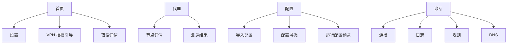

# Clash Harmony 鸿蒙版界面原型设计

版本：0.1  
日期：2026-07-01  
关联文档：[产品规划与设计文档](/Users/andy/My_codes/Clash_Harmony/docs/harmonyos-product-design.md)

可视化原型：[静态 HTML 原型](/Users/andy/My_codes/Clash_Harmony/docs/prototypes/clash-harmony-mobile-prototype.html)

## 1. 原型目标

本原型用于定义 Clash Harmony 鸿蒙版 0.1/MVP 的移动端主界面形态，重点覆盖：

1. 首屏 VPN 状态确认与一键连接。
2. 代理组与节点选择。
3. 配置订阅导入、更新、启用和增强入口。
4. 连接、日志、规则、DNS 的诊断入口。
5. 设置中的 VPN、DNS、核心、安全和备份分组。

设计原则：移动端优先、状态明确、错误可恢复、高级功能分层收纳。

## 2. 导航结构

主导航采用底部 4 Tab：

| Tab | 页面 | 用户任务 |
| --- | --- | --- |
| 首页 | `Home` | 连接/断开 VPN、查看当前配置、当前代理、流量、最近异常 |
| 代理 | `Proxies` | 切换策略组节点、测速、筛选排序、模式切换 |
| 配置 | `Profiles` | 导入订阅、本地配置、更新、启用、配置增强 |
| 诊断 | `Diagnostics` | 查看连接、日志、规则、DNS、导出诊断 |

设置不占底部 Tab，通过首页右上角入口进入。



## 3. 页面清单

| 编号 | 页面 | MVP | 说明 |
| --- | --- | --- | --- |
| P0 | 首次启动/授权 | 是 | 引导导入配置、申请 VPN 权限 |
| P1 | 首页-已连接 | 是 | 主状态页，原型默认态 |
| P2 | 首页-未连接/错误 | 是 | 展示失败原因和重试/诊断入口 |
| P3 | 代理列表 | 是 | 策略组、节点、延迟、筛选 |
| P4 | 配置列表 | 是 | 订阅和本地配置管理 |
| P5 | 导入配置 | 是 | URL、剪贴板、二维码、本地文件 |
| P6 | 配置增强 | 1.0 | Merge/Rules/Proxies/Groups |
| P7 | 诊断中心 | 是 | 连接、日志、规则、DNS 分段 |
| P8 | 设置 | 是 | VPN、DNS、核心、备份、安全、关于 |
| P9 | 运行配置预览 | 1.0 | runtime YAML、校验日志、回滚 |

## 4. 核心页面原型

### 4.1 首页

首页用于回答三个问题：现在有没有连上、走的是哪个配置、当前代理和流量是否正常。

首屏结构：

```text
┌──────────────────────────┐
│ Clash Harmony       设置 │
├──────────────────────────┤
│ 已连接  规则模式  运行 2h │
│        [ 断开 VPN ]       │
│ ↓ 4.2 MB/s  ↑ 820 KB/s   │
├──────────────────────────┤
│ 当前配置  HK Premium      │
│ 当前代理  Auto / JP-03    │
│ 模式      规则 全局 直连  │
├──────────────────────────┤
│ 最近状态                  │
│ DNS 正常 / 连接 42 / 日志 │
└──────────────────────────┘
```

首页状态：

| 状态 | 主按钮 | 状态文案 | 次操作 |
| --- | --- | --- | --- |
| 未连接 | 连接 VPN | 当前未接管网络 | 配置、诊断 |
| 准备中 | 正在准备 | 生成运行配置/申请权限 | 取消 |
| 连接中 | 正在连接 | 启动核心和 VPN | 查看日志 |
| 已连接 | 断开 VPN | 已连接，显示时长 | 切换代理、诊断 |
| 错误 | 重试连接 | 说明核心/VPN/配置错误 | 查看详情、回滚 |
| 需授权 | 去授权 | VPN 权限未授予 | 查看说明 |

### 4.2 代理页

代理页以策略组为主，不把所有节点平铺到一个超长列表中。

关键结构：

1. 顶部模式分段：规则、全局、直连。
2. 搜索与排序：节点名、地区、提供者、延迟。
3. 策略组条：当前路径优先展示。
4. 节点列表：当前选中、延迟、类型、提供者。
5. 底部操作：当前组测速、全部可见测速。

节点行字段：

| 字段 | 示例 | 说明 |
| --- | --- | --- |
| 节点名 | `JP-03 Tokyo` | 主标题 |
| 标签 | `Trojan / Provider A` | 类型与提供者 |
| 延迟 | `68 ms` | 颜色区分可用性 |
| 状态 | `当前` | 当前节点显示选中标识 |

### 4.3 配置页

配置页是订阅和运行配置的入口，避免移动端直接进入复杂 YAML 编辑。

关键结构：

1. 当前启用配置置顶。
2. 订阅卡片展示更新时间、节点数量、流量信息、下次更新。
3. 每个配置提供更新、启用、更多操作。
4. 增强入口独立成“配置增强”区块。
5. 运行配置预览和回滚放在高级区。

导入配置入口：

| 方式 | MVP | 说明 |
| --- | --- | --- |
| 订阅 URL | 是 | 输入/粘贴 URL |
| 剪贴板 | 是 | 自动识别 URL 或 YAML |
| 本地文件 | 是 | 选择 YAML/YML |
| 二维码 | 1.5 | 扫码或识别图片 |
| 备份包 | 1.0 | 导入本地备份 |

### 4.4 诊断页

诊断页采用分段控件，而不是独立底部 Tab，以减少主导航复杂度。

分段：

1. 连接：活跃连接、已关闭连接、关闭全部。
2. 日志：等级筛选、搜索、暂停、清空。
3. 规则：规则提供者、命中测试。
4. DNS：当前 DNS、最近失败、泄漏提示。

诊断导出位于页面右上角，导出前默认脱敏。

### 4.5 设置页

设置按“用户理解方式”分组，而不是按上游配置字段平铺。

| 分组 | 内容 |
| --- | --- |
| VPN | 自动连接、IPv6、局域网绕过、MTU、后台通知 |
| DNS | DNS 模式、DoH/DoT、Fake-IP、泄漏检测 |
| 核心 | 核心版本、运行方式、外部控制器、日志级别 |
| 配置 | 自动更新、失败回滚、增强开关 |
| 备份 | 本地备份、导入导出、WebDAV |
| 安全 | 敏感信息脱敏、Script 增强、控制器访问 |
| 关于 | 版本、许可证、项目链接 |

## 5. 组件规格

### 5.1 主状态块

用途：显示当前 VPN 状态和主操作。

字段：

1. 状态标签：未连接/连接中/已连接/错误。
2. 模式标签：规则/全局/直连。
3. 运行时长。
4. 主操作按钮。
5. 实时速率。

### 5.2 模式分段控件

三段固定：规则、全局、直连。当前模式使用实底，其他为空底。切换后需要触发核心配置 PATCH，失败时回退 UI 状态。

### 5.3 节点行

交互：

1. 点击节点立即选择。
2. 长按或更多按钮打开节点详情。
3. 延迟标签点击可单节点测速。

### 5.4 配置卡片

交互：

1. 点击卡片进入详情。
2. 主按钮根据状态显示“启用”或“更新”。
3. 更多菜单包含重命名、复制链接、查看原始配置、删除。

### 5.5 错误提示

错误不只显示 toast。影响连接的错误必须在首页保留一个可点击的错误条。

错误分类：

1. VPN 权限错误。
2. 核心启动失败。
3. 配置校验失败。
4. DNS 异常。
5. 订阅更新失败。
6. 后台运行被系统终止。

## 6. 视觉规范

### 6.1 布局

1. 手机原型宽度按 390px 设计。
2. 顶部状态栏 28px，应用栏 52px，底部导航 68px。
3. 内容区左右边距 16px。
4. 卡片圆角 8px，工具按钮圆角 8px。
5. 列表行最小高度 56px。

### 6.2 色彩

| Token | 用途 |
| --- | --- |
| `#0f172a` | 主文字/深色背景 |
| `#f8fafc` | 页面背景 |
| `#0f766e` | 连接成功/主操作 |
| `#2563eb` | 信息/可点击状态 |
| `#d97706` | 警告 |
| `#dc2626` | 错误 |
| `#475569` | 次级文本 |
| `#e2e8f0` | 分割线/描边 |

### 6.3 字体层级

| 层级 | 大小 | 用途 |
| --- | --- | --- |
| Title | 20 | 页面标题 |
| Section | 16 | 分组标题 |
| Body | 14 | 正文与列表 |
| Caption | 12 | 标签、说明、速率 |
| Metric | 24 | 首页关键数字 |

## 7. 平板与折叠屏适配

当宽度大于 720px：

1. 首页采用两栏：左侧运行状态，右侧当前配置/诊断摘要。
2. 代理页采用策略组列表 + 节点详情双栏。
3. 配置页采用配置列表 + 详情双栏。
4. 诊断页采用左侧分段导航 + 右侧内容。

## 8. MVP 交互验收

1. 用户能在首页 1 步连接/断开 VPN。
2. 用户能在代理页 2 步内切换任意常用策略组节点。
3. 用户能在配置页 3 步内导入订阅并启用。
4. 用户能在诊断页 2 步内查看最近错误日志。
5. 任一连接失败都能在首页看到可恢复入口。
6. App 退后台后再次进入，首页状态必须与 VPN/核心实际状态一致。

