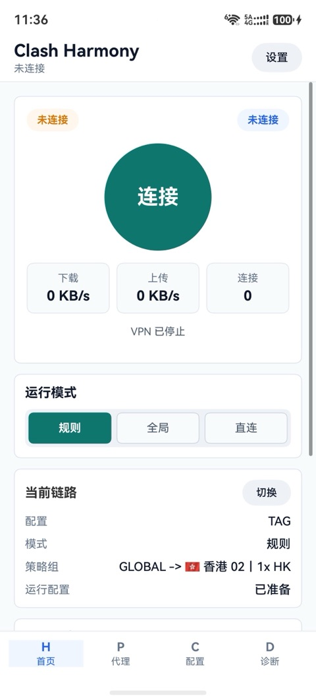
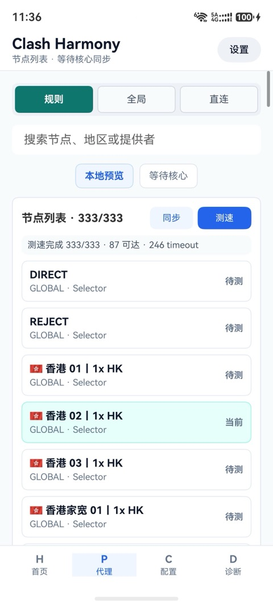
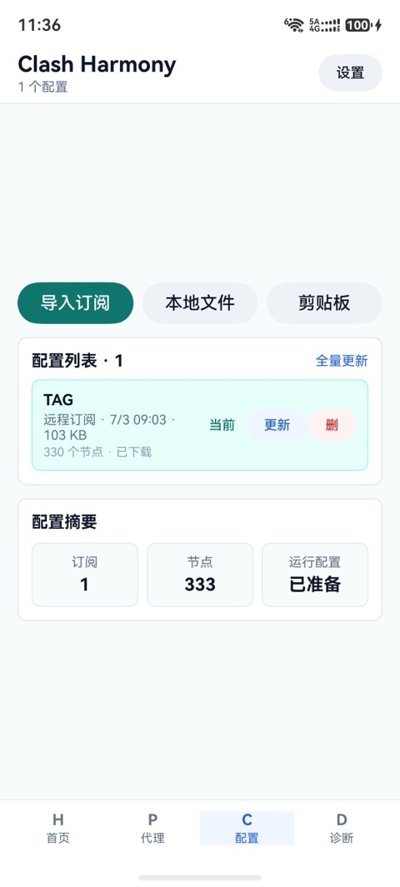
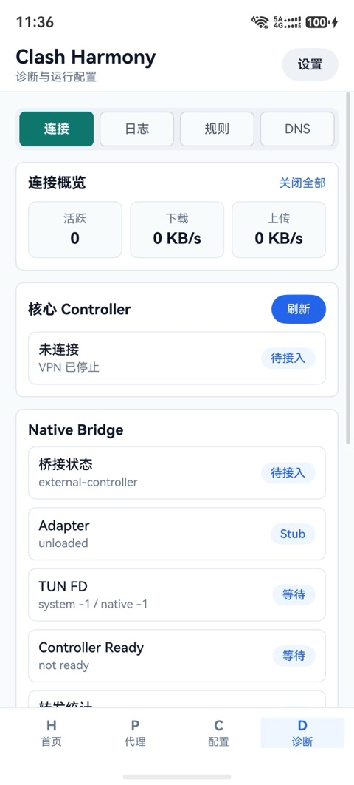

# Clash Harmony 项目总结

生成时间：2026-07-06 11:35 CST  
仓库地址：https://github.com/andycaihello/clash-harmony  
当前分支：`main`  
当前提交：`a6795a0 Initial Clash Harmony implementation`

## 1. 项目概述

Clash Harmony 是一个 HarmonyOS / ArkTS Stage 项目，目标是在鸿蒙真机上实现 Clash/mihomo 风格的代理与 VPN 工作流。项目从界面原型、配置导入、节点测速、runtime 配置生成、mihomo native 集成、VPN Extension、controller 诊断，到真机安装验证，最终形成了一个可以在真机上运行并连接 VPN 的版本。

当前版本已经完成：

- 首页、代理、配置、诊断四个核心页面。
- 远程订阅、本地文件、剪贴板导入。
- Clash YAML 解析和 Shadowsocks 通用订阅转换。
- 全量节点测速，节点后展示延迟或 timeout。
- mihomo controller 封装：`/version`、`/configs`、`/proxies`、`/connections`、`/rules`。
- VPN Extension 创建 TUN，并将运行配置交给 native/mihomo。
- 真实 `arm64-v8a/libmihomo_ohos.so` 集成和 HAP 打包校验。
- 首页实时状态刷新：连接状态、运行时长、下载/上传速度、连接数、当前链路。
- README 已更新，项目已推送到 GitHub。

## 2. 时间与 Token 消耗

### 可审计时间

从仓库文件时间看，项目最早文档创建于：

- `2026-07-01 11:46:33`：`docs/harmonyos-product-design.md`

当前总结生成于：

- `2026-07-06 11:35:24`

按仓库可见时间计算，项目跨度约 **4 天 23 小时 49 分**，约等于 **5 个自然日**。

### Codex 接管后的统计

Codex Goal 统计显示：

- Token 使用量：**2,087,397 tokens**
- 活跃执行时间：**7,481 秒**
- 折算时间：**约 2 小时 4 分 41 秒**

说明：这部分是 Codex 当前目标追踪器可读取到的统计。项目之前也经过 Claude Code 和其他 Codex 会话处理，历史精确 token 消耗无法从当前本地仓库或设备中读取，因此不在这个数字内。若需要完整账单级 token，需要从对应平台的 usage/billing 记录导出。

## 3. 关键阶段

### 3.1 需求梳理与页面闭环

最初需求不是单点功能，而是要按页面完整闭环：

- 首页：连接、模式、状态、当前链路、最近状态。
- 代理：节点列表、搜索、测速、策略组、节点选择。
- 配置：订阅导入、更新、启用、删除、运行配置生成。
- 诊断：controller、native bridge、TUN、DNS、规则、连接等状态。

处理方式：

- 先按四个页面列功能清单。
- 再逐项设计、实现、测试和真机验证。
- 对用户反馈的问题按页面回补，而不是只修某个按钮。

### 3.2 mihomo 集成问题

关键问题：

- HarmonyOS 不能直接照搬普通 Linux/macOS 的 mihomo 运行方式。
- Go runtime、native `.so`、VPN Extension、TUN fd、socket 防环路之间存在系统差异。
- 初期 fake/stub adapter 只能验证界面和 native bridge，不能真正代理网络。

解决方式：

- 接入真实 `arm64-v8a/libmihomo_ohos.so`。
- native bridge 动态加载 `MihomoStart/MihomoStop/MihomoVersion/MihomoLastError`。
- 打包 `libmihomo_exec.so` 作为执行 fallback。
- HAP 校验脚本检查 native 库是否进入最终包，并检查 `DT_NEEDED` 依赖闭包。

最终状态：

- 真机 HAP 内包含真实 `arm64-v8a/libmihomo_ohos.so`。
- controller 可通过 `127.0.0.1:9090` 访问。
- HTTP 代理可通过 `127.0.0.1:7890` 访问。
- VPN 真机链路已验证可通。

### 3.3 VPN Extension 与 controller ready

关键问题：

- App 主进程和 VPN Extension 进程不是同一运行上下文。
- 主进程连接按钮返回成功，不代表 VPN 进程里的 mihomo controller 已经 ready。
- 安装新 HAP 后，旧 App 进程可能仍在，导致界面和逻辑不是最新代码。

解决方式：

- 在 VPN Extension 中启动后等待 controller `/version`。
- controller ready 后回写 `CoreBridgeService.markControllerReady(...)` 状态。
- 真机安装验证流程改为先执行：

```bash
aa force-stop io.github.clashharmony.app
```

再安装和启动，避免旧进程继续显示旧 UI。

### 3.4 订阅、节点和测速

关键问题：

- 早期测速只测部分节点，用户期望列表中每个节点都测。
- 点击测速没有明显 UI 反馈，用户无法判断是否正在执行。
- 部分节点可用性和 controller delay 结果不一致，需要明确 timeout 状态。

解决方式：

- 代理页改为全量节点测速。
- 批量并发控制，避免一次性压垮网络和 controller。
- 每个节点后直接显示状态：延迟值或 `timeout`。
- 测速按钮、进度文本、汇总结果全部给出 UI 反馈。

当前结果：

- 代理页可展示 `333/333` 节点。
- 测速完成后可展示可达数量和 timeout 数量。
- 当前截图中示例为：`87 可达 · 246 timeout`。

### 3.5 首页状态刷新问题

关键问题：

- 用户反馈：切到其他页面再切回首页，状态才刷新。
- 首页的连接状态、运行时长、下载/上传速度、连接数、当前链路都存在不同程度的刷新滞后。
- ArkUI 中通过 Builder 参数传值的 `Pill()`、`Metric()`、`InfoRow()` 在部分场景下没有稳定触发可见树刷新。
- 速度计算早期使用当前连接列表字节累加，连接关闭或变化后速度会不准或不变。

解决方式：

- 首页增加独立 live 状态字段：
  - `liveConnected`
  - `liveUptime`
  - `liveDownloadSpeed`
  - `liveUploadSpeed`
  - `liveConnections`
  - `liveProfileName`
  - `liveProxyName`
  - `liveRuntimeConfigState`
  - `liveRefreshToken`
- 状态卡中的动态文字全部改为直接绑定 `Text(this.liveXxx)`。
- 当前链路卡也改为直接绑定 live 字段，不再通过通用 `InfoRow()` 间接传参。
- 运行时长 60 秒内显示 `Xs`，避免刚连接后一直显示 `0m`。
- 流量速度改用 mihomo `/connections` 顶层累计字段：
  - `downloadTotal`
  - `uploadTotal`
- 通过累计差值除以轮询间隔计算实时下载/上传速度。

当前状态：

- 当前链路已确认可即时显示 `TAG`。
- 首页状态卡已改成直接绑定 live 字段。
- 最新 HAP 已安装到真机。

### 3.6 DNS 和网络连通

关键问题：

- 节点测速和 VPN 连接中存在 DNS/域名解析不稳定。
- HarmonyOS VPN 环境下，DNS、host resolve、redir-host、IPv6 行为需要约束。

解决方式：

- Runtime 配置生成时注入 hosts 预解析结果。
- 设置 `dns.use-hosts: true`。
- 使用 `redir-host`。
- 禁用 IPv6。
- 在 native 层增加 socket 防环路保护，避免 mihomo 自身连接被 VPN 回环。

### 3.7 真机自动化验证受锁屏影响

关键问题：

- 真机容易自动锁屏。
- `uitest uiInput` 点击在锁屏或页面滚动后会失效。
- 自动截图有时抓到锁屏而不是 App 页面。

解决方式：

- 截图前先 `aa start` 拉起应用。
- 必要时上滑解锁。
- 使用 `dumpLayout` 和截图双重判断。
- 对关键 VPN 网络能力，以 controller/TUN/端口转发/curl 结果为主要证据，而不是只依赖 UI 截图。

## 4. 当前验证证据

### 构建

构建命令：

```bash
/Applications/DevEco-Studio.app/Contents/tools/hvigor/bin/hvigorw assembleHap --mode module -p module=entry@default -p product=default
```

构建结果：

- `BUILD SUCCESSFUL`

最新 HAP：

```text
entry/build/default/outputs/default/entry-default-signed.hap
```

最近安装到真机的 HAP hash：

```text
798bb2a37164775359f279b4e5710878ecff8293713665827bca8b622e5b5000
```

### 测试脚本

已通过：

```bash
node tests/app-flow.test.mjs
node --check tests/app-flow.test.mjs
node --check tests/verify-hap-contents.mjs
node --check tests/verify-device-mihomo.mjs
node tests/verify-hap-contents.mjs entry/build/default/outputs/default/entry-default-signed.hap
```

### GitHub

已推送：

```text
git@github.com:andycaihello/clash-harmony.git
```

远程分支：

```text
main -> origin/main
```

提交：

```text
a6795a0 Initial Clash Harmony implementation
```

## 5. 当前成品状态

### 已完成

- 项目可在 DevEco Studio 中打开。
- HAP 可构建、签名、安装到真机。
- 真机可导入订阅。
- 配置可生成 runtime YAML。
- 代理页可展示全部节点并测速。
- 节点选择可写入 controller。
- VPN 真机链路已跑通。
- 首页状态刷新链路已针对 ArkUI 重绘问题修复。
- 项目已上传 GitHub。

### 仍需后续优化

- 真机锁屏会影响自动化 UI 测试，需要后续加更稳定的自动化测试方案。
- `x86_64` 仍使用 fake/stub adapter，模拟器不代表真实 VPN 能力。
- 剪贴板和文件导入相关 API 仍有 ArkTS warning，需要后续按 HarmonyOS 新 API 调整。
- 当前 UI 仍是工程可用版，后续可以继续做交互细节和视觉一致性打磨。
- 可以补充 release 流程、CI 构建、自动生成 HAP 校验证据包。

## 6. 成品界面截图

以下截图来自 2026-07-06 11:36 真机。

### 首页



### 代理页



### 配置页



### 诊断页


